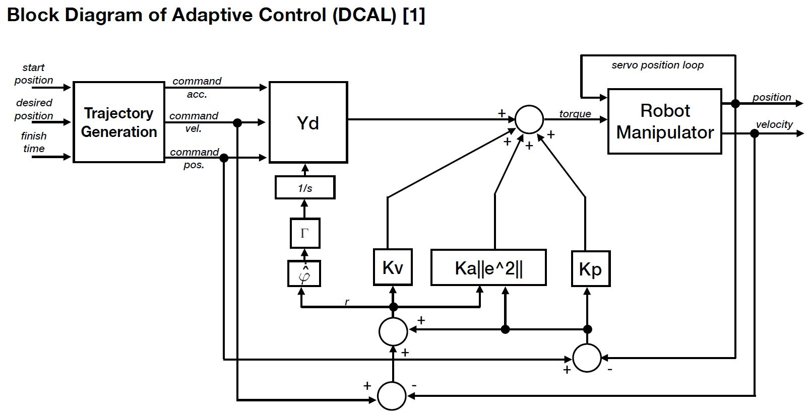
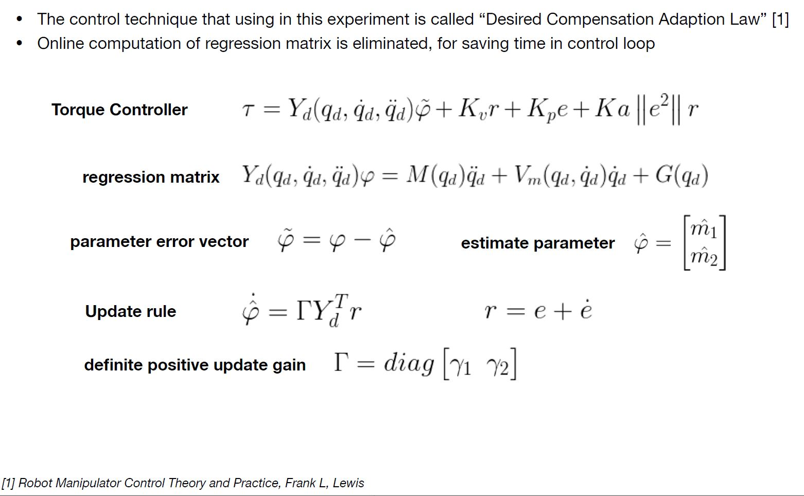
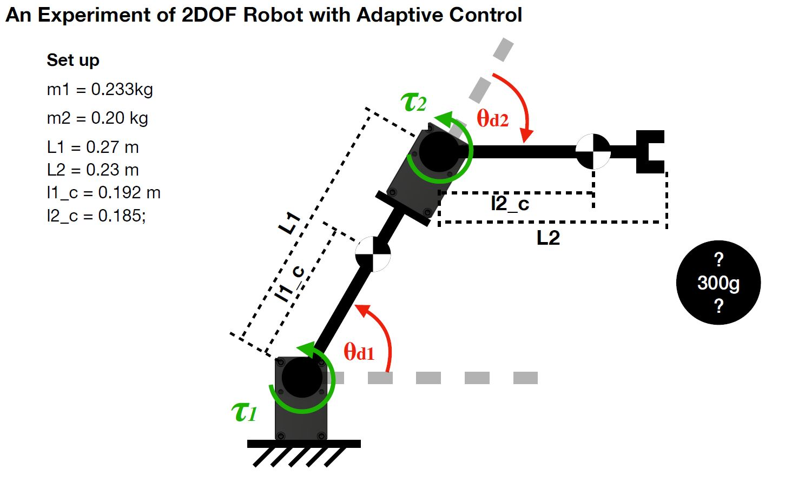

# Adaptive-Control-of-2DOF-Robot-Arm
This project is to test the Adaptive Control with 2 DOF robot arm. The arm is constructed w with simple carbon pip with direct drive servo. Dynamixel servo is used in this project for setup and detail please follow this link https://github.com/ROBOTIS-GIT/DynamixelSDK

# Concept
The purpose for applying adaptive control is when the robot is attached the load at end effector, it can adapt itself to compensate unknown load. This will cause the problem when robot is using Computed Torque Control mode, which means the robot dynamics is taken into account and the input to the robot is torque of each joint. The CTC will work perfectly if all of the parameters (mass, inertia) are known. But if there is some unknown load attached on, the robot will have big error and not be able to compensate that error. The adaptive control is play an important role for a general application which requires safety collaboration with robot and compliant interaction.

# Block diagram
Adaptive control has many strategies and each its own feedback data. You will see the dynamics equation was rearranged to "Regression matrix". The estimated parameter in here are measses from link 1 and 2. The control technique that I am using in here is "Desired Compensatio Adaption Law".

